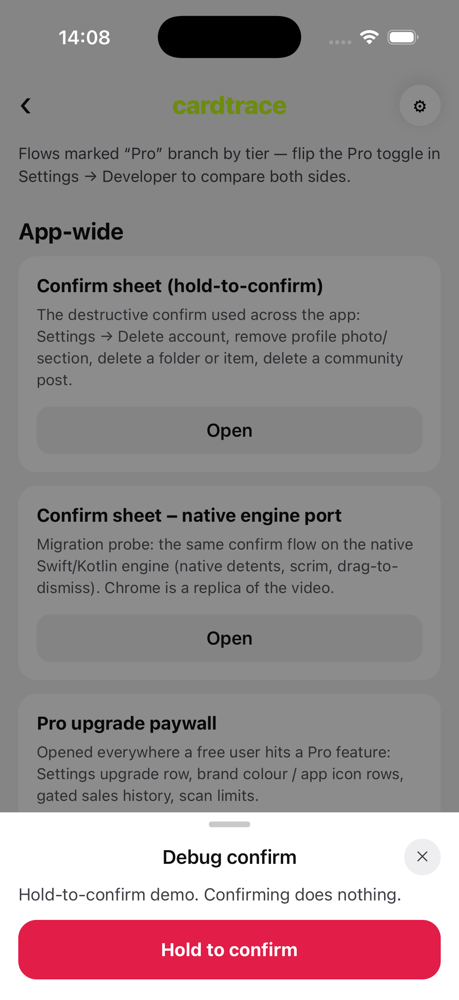

# Native Bottom Sheet

A React Native / Expo bottom sheet with a **native Swift + Kotlin engine**. Overlay (scrim), detents, spring motion, and sheet dragging run natively. Chrome (handle, header, footer, hold-to-confirm) stays in JS.

The example catalog mirrors Cardtrace sheets (confirm, emoji, folders, forms, persistent scan).



## Contents

- [Install](#install)
- [Concepts](#concepts)
- [Quick start](#quick-start)
- [Detents](#detents)
- [Modal vs inline](#modal-vs-inline)
- [Overlay / scrim](#overlay--scrim)
- [Corners and background](#corners-and-background)
- [Dynamic sizing (`content`)](#dynamic-sizing-content)
- [Keyboard](#keyboard)
- [Non-dismissible sheets](#non-dismissible-sheets)
- [Scroll negotiation](#scroll-negotiation)
- [Nested pages](#nested-pages)
- [JS chrome](#js-chrome)
- [Events](#events)
- [API](#api)
- [Native engine](#native-engine)
- [Limits](#limits)
- [Example app](#example-app)
- [Develop](#develop)

## Install

```sh
npx expo install bottom-sheet-native
```

Requires a **development build** (`npx expo run:ios` / `npx expo run:android`). **Expo Go cannot load** the native engine.

Peers: `expo`, `react`, `react-native`. Targeted at Expo SDK 57.

Wrap the app **once** at the root:

```tsx
import { BottomSheetProvider } from 'bottom-sheet-native';

export default function App() {
  return <BottomSheetProvider>{/* screens */}</BottomSheetProvider>;
}
```

`ModalBottomSheet` requires `BottomSheetProvider` (it portals the sheet to the root). Missing the provider throws.

## Concepts

| Layer | Owns | Does not own |
| --- | --- | --- |
| Native (Swift / Kotlin) | Overlay/scrim, detents, spring, sheet drag, IME insets, corner clip | Handle, lists, forms, buttons |
| JS | Controlled `index`, chrome, content, page stack | Drawing dim with a JS `Pressable` / portal overlay |

`index` is always **controlled**. Native fires `onIndexChange` when the user snaps; you must `setIndex`. Close the sheet by moving `index` to the closed detent (`0` when the first detent is `0`).

## Quick start

```tsx
import { useState } from 'react';
import { Text, View } from 'react-native';
import {
  BottomSheetProvider,
  ModalBottomSheet,
  SheetHandle,
  SheetHeader,
} from 'bottom-sheet-native';

function Example() {
  const [index, setIndex] = useState(0);

  return (
    <BottomSheetProvider>
      <ModalBottomSheet
        detents={[0, 'content']}
        index={index}
        onIndexChange={setIndex}
        scrimColor="rgba(0,0,0,0.45)"
        sheetBackgroundColor="#fff"
        sheetCornerRadius={28}
      >
        <SheetHandle />
        <SheetHeader title="Hello" onClose={() => setIndex(0)} />
        <View style={{ padding: 16 }}>
          <Text>Content-sized sheet. Drag or tap the overlay to dismiss.</Text>
        </View>
      </ModalBottomSheet>
    </BottomSheetProvider>
  );
}
```

Open: `setIndex(1)`. Close: `setIndex(0)`, or tap the scrim / drag down when `dismissible`.

## Detents

`detents` is an array of snap heights in **ascending** order. Each entry:

| Value | Meaning |
| --- | --- |
| `0` | Closed (height 0). Usually first. |
| `168` / `300` | Absolute points (iOS pt; JS dp, converted to px on Android). |
| `` `'90%'` `` | Percent of the host’s usable height. |
| `'content'` | JS content height (`onLayout`), capped at usable height. |
| `programmatic(value)` | Reachable only via `index` — **not** drag or scrim tap. |

```tsx
import { programmatic } from 'bottom-sheet-native';

// Peek 176, full 92%. Drag skips mid 260 — only setIndex can land there.
detents={[0, 176, programmatic(260), '92%']}
```

`index` must be an integer in `0 .. detents.length - 1`. Invalid values throw.

**Flick:** drag speed ≥ ±600 pt/s jumps to the next taller / shorter **draggable** detent (skips `programmatic`).

## Modal vs inline

### `ModalBottomSheet`

- Sets `modal={true}`.
- Portals into `BottomSheetProvider` (full screen).
- Native scrim; tap outside to dismiss when `dismissible`.
- Default `scrimColor="rgba(0,0,0,0.45)"`.

Use for confirm, action menus, forms, paywalls.

### `BottomSheet`

- Inline in the parent layout (no portal, no scrim unless you draw one).
- Same native detents and drag.

`nativeOverlay` on `ModalBottomSheet` only changes layout (no portal). It does **not** hoist a `UIWindow` / `Dialog` — the overlay is still the in-tree native scrim.

## Overlay / scrim

The scrim is **native** (`UIControl` / `View`), host-sized, with alpha interpolated across detents.

```tsx
<ModalBottomSheet
  scrimColor="rgba(0,0,0,0.45)"
  scrimOpacities={[0, 1]} // one value per detent
  detents={[0, 'content']}
  index={index}
  onIndexChange={setIndex}
/>
```

- Omit `scrimOpacities` → closed detent = 0, others = 1.
- Scrim tap snaps to the closed detent that is **not** `programmatic`, when `dismissible`.
- Prefer `rgba(...)` or `#RRGGBB`. 8-digit hex is treated as **AARRGGBB** and converted to rgba (RN would otherwise read RRGGBBAA and get alpha 0).
- Transparent preview: `scrimColor="#00000000"` or `rgba(0,0,0,0)`.

While a `'content'` detent resizes (nested pages), the scrim **stays** at the open detent’s opacity — it does not interpolate against the transient height.

## Corners and background

```tsx
sheetBackgroundColor="#fff"
sheetCornerRadius={28} // default 28, top corners only
```

Or pass `surface` for a custom full-canvas background. Without `surface`, `sheetBackgroundColor` paints the fill.

iOS clips `sheetContainer`; Android uses `clipToOutline` on the container. **Rebuild native** after Swift/Kotlin changes — Fast Refresh is not enough.

## Dynamic sizing (`content`)

There is no Gorhom-style `enableDynamicSizing` flag. Declare a `'content'` detent:

1. JS measures children with `onLayout` → `contentHeight`.
2. Native height = `min(contentHeight + keyboardExtend, maxHeight)`.
3. Height changes while parked on `'content'` animate when `animateContentHeight` is `true` (default).

Content taller than the screen is **clipped**. Add a `%` detent or an inner `ScrollView`.

A transient `contentHeight` of `0` while swapping children is **not** sent to native (avoids treating the sheet as closed).

## Keyboard

`keyboardBehavior`:

| Value | Behavior |
| --- | --- |
| `'none'` | SWM default. Ignore IME. |
| `'extend'` | Add IME height to a `'content'` detent (Wanted card, Offer). |
| `'stick'` | Keep the detent. Emit `onKeyboardChange`. Pin search/footer with `SheetDock` or `useKeyboardInset()` (Add cards, Emoji). |

```tsx
<ModalBottomSheet
  detents={[0, 'content']}
  keyboardBehavior="extend"
  index={index}
  onIndexChange={setIndex}
>
  <TextInput placeholder="Notes" />
</ModalBottomSheet>
```

```tsx
<ModalBottomSheet keyboardBehavior="stick" /* ... */>
  <ScrollView>{/* list */}</ScrollView>
  <SheetDock>
    <TextInput placeholder="Search" />
  </SheetDock>
</ModalBottomSheet>
```

`useKeyboardInset()` returns keyboard height in pt/dp. Pair with `animateContentHeight={false}` if you animate padding yourself.

## Non-dismissible sheets

```tsx
<ModalBottomSheet
  detents={[0, '22%', '70%']}
  dismissible={false}
  index={Math.max(index, 1)}
  onIndexChange={(next) => setIndex(Math.max(1, next))}
>
```

- Drag / scrim tap **cannot** reach detent 0.
- You can still `setIndex(0)` in code if you need to unmount.

Use for Scan results (always-on peek).


## Scroll negotiation

When a list lives inside the sheet, native decides whether the list or the sheet owns the pan.

`scrollableNegotiation`: `'none' | 'initial' | 'handoff'` or `{ expand, collapse }`.

Default `{ expand: 'handoff', collapse: 'initial' }`.

- `'none'` — sheet does not steal the list’s gesture.
- `'initial'` — sheet takes the gesture if the list is already at its edge on touch down.
- `'handoff'` — scroll the list to the edge, then hand off to the sheet.

`disableScrollableNegotiation` (deprecated) equals `'none'`.

There is **no** drag-and-drop to reorder items. Dragging an item scrolls the list or moves the sheet.

## Nested pages

One sheet, multiple pages. Height follows `'content'` + `animateContentHeight`.

```tsx
import { useSheetStack, SheetFooter } from 'bottom-sheet-native';

function FolderColor({ open, onClose }: { open: boolean; onClose: () => void }) {
  const stack = useSheetStack<'list' | 'custom'>('list');

  return (
    <ModalBottomSheet
      detents={[0, 'content']}
      index={open ? 1 : 0}
      onIndexChange={(next) => {
        if (next === 0) {
          stack.reset();
          onClose();
        }
      }}
    >
      {stack.page === 'list' ? (
        <Pressable onPress={() => stack.push('custom')}>
          <Text>Pick custom colour</Text>
        </Pressable>
      ) : (
        <SheetFooter onBack={stack.pop}>
          <Pressable onPress={onClose}><Text>Select colour</Text></Pressable>
        </SheetFooter>
      )}
    </ModalBottomSheet>
  );
}
```

`useSheetStack(root)` → `{ page, depth, stack, push, pop, reset }`.

## JS chrome

Product UI is JS. Native only owns motion.

| Component | Role |
| --- | --- |
| `SheetHandle` | Drag pill at the top edge. |
| `SheetHeader` | Centered title, close (`onClose`), optional `accessory`. |
| `SheetFooter` | Bottom row: `onBack` (‹) + `children` (usually a CTA). |
| `SheetDock` | `paddingBottom` = IME. Use with `keyboardBehavior="stick"`. |
| `HoldToConfirmButton` | Hold for `holdMs` (default 900) before `onConfirm`. |

```tsx
<HoldToConfirmButton label="Hold to confirm" onConfirm={onClose} holdMs={900} />
```


## Events

| Event | When |
| --- | --- |
| `onIndexChange(index)` | User **started** a snap (drag, flick, scrim). **Not** fired for your `setIndex`. Update state here. |
| `onSettle(index)` | Snap **finished**, including programmatic. |
| `onPositionChange({ nativeEvent: { position, index } })` | Every frame. `position` is pt from the bottom; `index` is a fractional detent. |
| `onKeyboardChange(height)` | IME overlap in pt/dp. |

Pass `wrapNativeView={Animated.createAnimatedComponent}` to handle `onPositionChange` on the UI thread.

## API

### `ModalBottomSheet` / `BottomSheet`

| Prop | Default | Notes |
| --- | --- | --- |
| `children` | — | Content. Height from `onLayout`. |
| `index` | **required** | Current detent. |
| `detents` | `[0, 'content']` | See [Detents](#detents). |
| `onIndexChange` | — | User-driven snap. |
| `onSettle` | — | Snap finished. |
| `onPositionChange` | — | Per frame. |
| `animateIn` | `true` | Animate from closed on first layout. |
| `animateContentHeight` | `true` | Animate when the active `'content'` height changes. |
| `extendUnderStatusBar` | `false` | Allow full-height detents under the status bar. |
| `dismissible` | `true` | `false` blocks drag/scrim to 0. |
| `keyboardBehavior` | `'none'` | `'none'` / `'extend'` / `'stick'`. |
| `onKeyboardChange` | — | IME height. |
| `sheetBackgroundColor` | — | Fill. Prefer `#fff` / `rgba`. |
| `sheetCornerRadius` | `28` | Top corners only. |
| `surface` | — | Custom background instead of the built-in fill. |
| `scrollableNegotiation` | `{ expand: 'handoff', collapse: 'initial' }` | See above. |
| `style` | — | Host style (rarely needed with the modal portal). |
| `wrapNativeView` | — | Wrap the native view (Reanimated). |

Modal only:

| Prop | Default | Notes |
| --- | --- | --- |
| `scrimColor` | `rgba(0,0,0,0.45)` on `ModalBottomSheet` | Overlay color. |
| `scrimOpacities` | closed = 0, open = 1 | One 0–1 value per detent. |
| `nativeOverlay` | `false` | Skip the portal. Not a system window/dialog. |

### `programmatic(value)`

```ts
programmatic(300) // { value: 300, programmatic: true }
```

### `useKeyboardInset(): number`

### `useSheetStack<T>(root: T)`

`{ page, depth, stack, push, pop, reset }`

### `NativeBottomSheetView`

The Expo native view. Prefer `BottomSheet` / `ModalBottomSheet` instead of using it directly.

## Native engine

| Concern | Implementation |
| --- | --- |
| Snap | Critically damped spring, ζ = 1, 0.45s, ω = 8 / duration |
| Flick | ±600 pt/s |
| `'content'` | JS `onLayout` (dp) → iOS pt / Android px |
| IME | iOS keyboard frame; Android `WindowInsetsCompat.Type.ime()` |
| Nav inset | Android `Type.navigationBars()` — not double-counted with `systemWindowInsetBottom` |
| Scroll | iOS `UIScrollView` pin + handoff; Android nested-scroll intercept |
| Scrim | Native full-host view, interpolated `scrimOpacities` |
| Corners | Clip the container, top corners only |
| Touches when closed | Host `dispatchTouchEvent` returns false when height ≈ 0 |

## Limits

- iOS + Android. Web has a stub, not a full engine.
- Expo Go is not supported.
- No drag-and-drop item reorder inside a list.
- No `enableDynamicSizing` separate from a `'content'` detent.
- No native intrinsic measure (`UNSPECIFIED` / Auto Layout — avoided because it crashed RN views).
- Overlay is not a system `UIWindow` / `Dialog`.
- Swift/Kotlin changes need `expo run:ios` / `expo run:android`, not Metro alone.

## Example app

Catalog: `example/App.tsx`.

```sh
cd example
npx expo run:ios --device "iPhone 17 Pro"
```

Android — pass the **AVD name**, not the adb serial:

```sh
export ANDROID_HOME="$HOME/Library/Android/sdk"
export PATH="$ANDROID_HOME/emulator:$ANDROID_HOME/platform-tools:$PATH"
npx expo run:android --device Pixel_9_Pro
```

Wrong: `--device emulator-5554` → Expo cannot find the device.

## Develop

In the module repo:

```sh
npm test
npm run lint
npm run build
```

Example typecheck:

```sh
cd example && npx tsc --noEmit
```

## License

MIT
